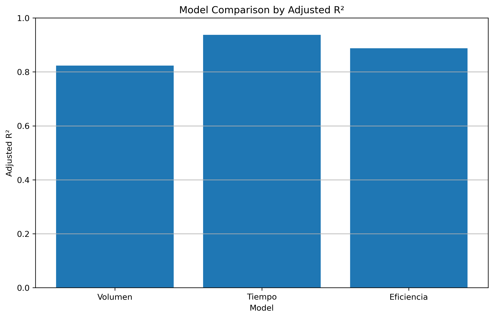
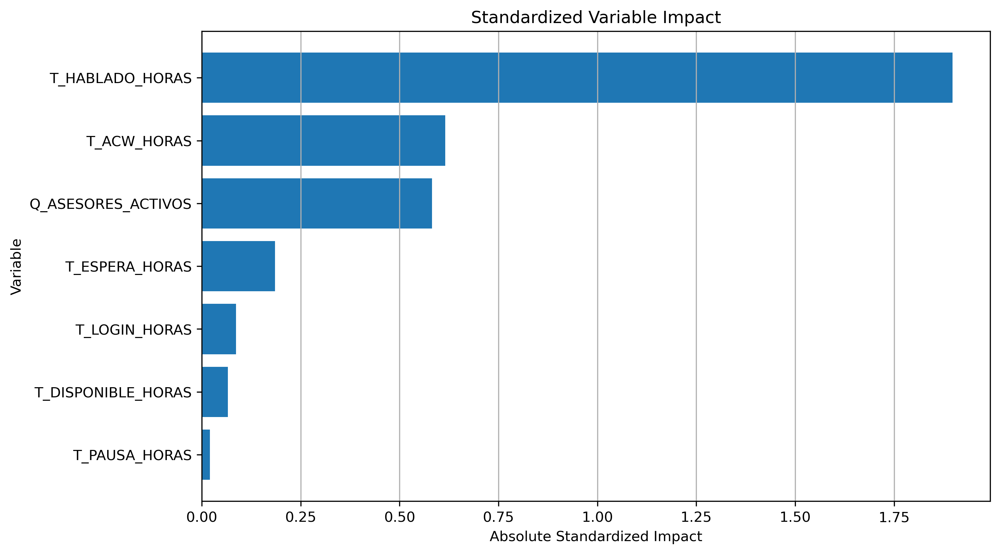
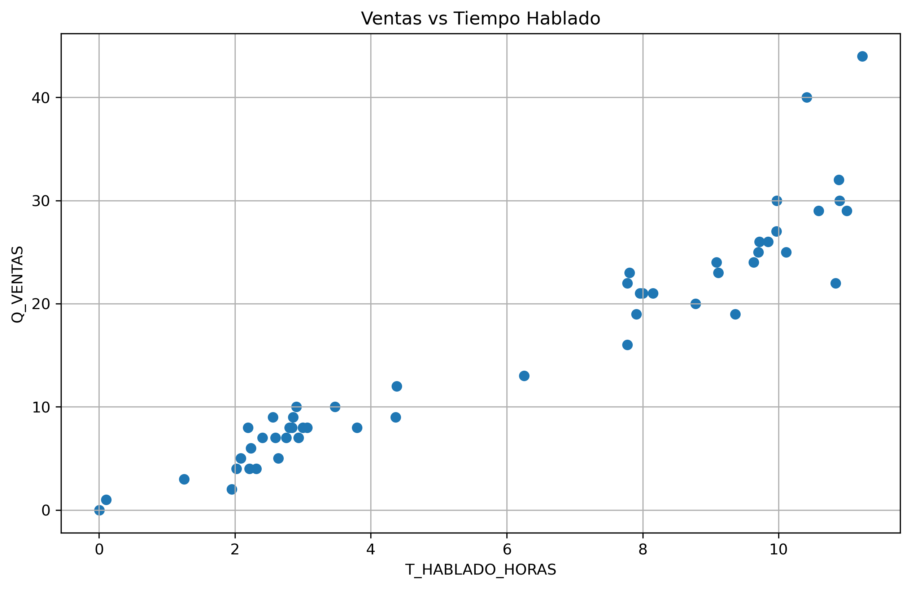
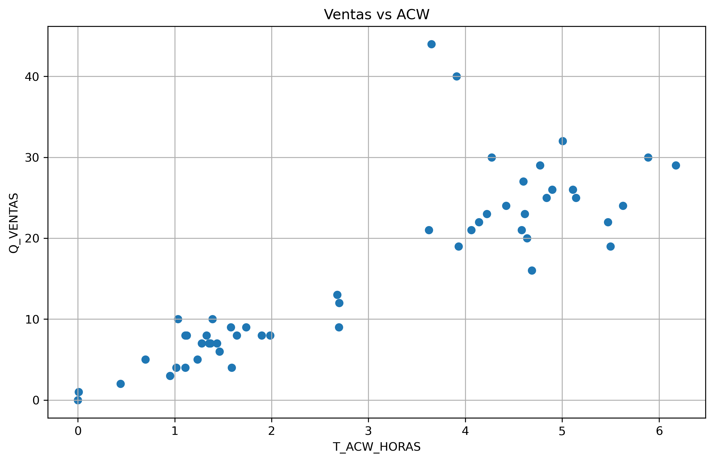
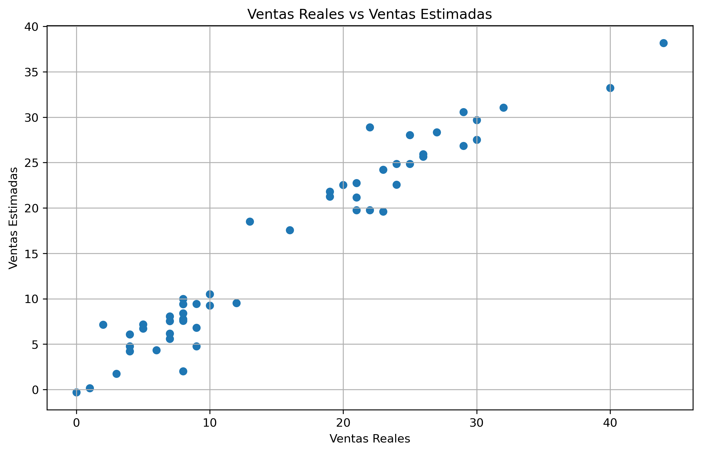
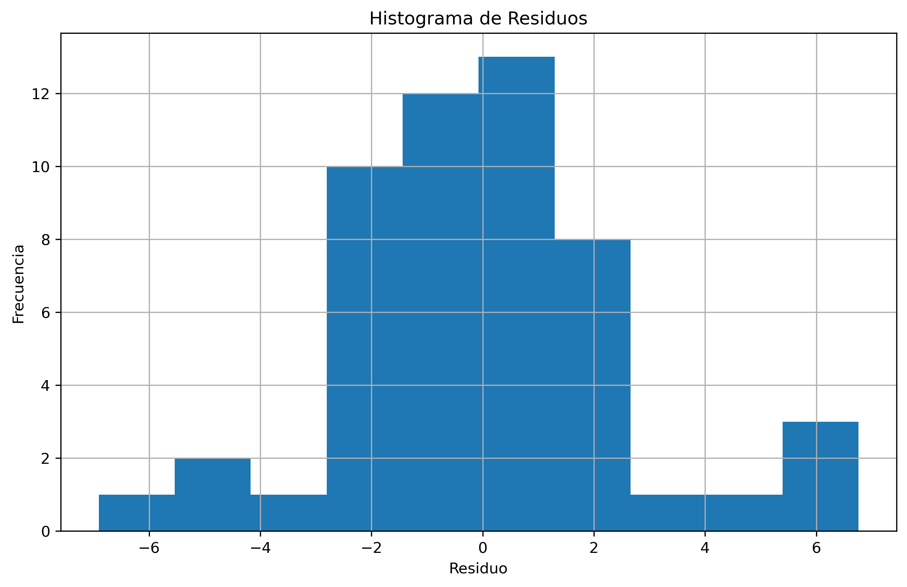

# Call Center Sales Drivers Regression Analysis

## Project Overview

This project analyzes operational sales drivers in a call center campaign using SQL, Python and linear regression.

The objective was to identify which operational variables were most associated with daily sales performance at supervisor-campaign level.

The analysis transformed operational call center data into a business-oriented diagnostic model focused on understanding what explains sales variation.

## Business Question

Which operational variables best explain sales performance?

The analysis focused on answering:

- What operational factors are most associated with sales?
- Does sales performance depend more on call volume, time usage or operational efficiency?
- Which variables should supervisors monitor to improve commercial performance?
- What operational behavior should advisors prioritize to increase expected sales?

## Data Scope

The analysis was performed at supervisor-day-campaign level.

The original operational dataset included variables related to:

- sales quantity
- call attempts
- effective contacts
- non-contact records
- login time
- talk time
- pause time
- waiting time
- available time
- after-call work time
- supervisor information
- campaign information

The original raw data is not included in the GitHub repository due to confidentiality restrictions.

## Methodology

Three groups of regression models were compared:

| Model | Description |
|---|---|
| Volume Model | Call attempts, contacts and operational volume variables |
| Time Model | Login time, talk time, pause time, waiting time, available time and ACW |
| Efficiency Model | Productivity ratios such as contactability, calls per hour and contacts per hour |

The models were evaluated using:

- Adjusted R²
- AIC
- BIC
- coefficient significance
- business interpretability

## Main Finding

The time-based model showed the strongest explanatory power.

The final simplified model retained two key variables:

- `T_HABLADO_HORAS`: talk time hours
- `T_ACW_HORAS`: after-call work hours

Final model:

```text
Q_VENTAS = -0.329279 + 4.749583*T_HABLADO_HORAS - 4.062390*T_ACW_HORAS

## Visual Results

### Model Comparison

The time-based model showed the strongest explanatory power among the evaluated model groups.



### Standardized Variable Impact

Talk time showed the strongest positive association with sales, while ACW represented the main operational friction.



### Sales vs Talk Time

The relationship between talk time and sales shows a clear positive pattern. This supports the finding that effective commercial conversation time is the main operational driver.



### Sales vs ACW

ACW represents post-call work. When ACW increases excessively, it reduces available commercial capacity.



### Actual vs Predicted Sales

The final model shows a strong alignment between actual and predicted sales at supervisor-day-campaign level.



### Residual Distribution

The residual histogram provides a basic view of how prediction errors are distributed around the model.

