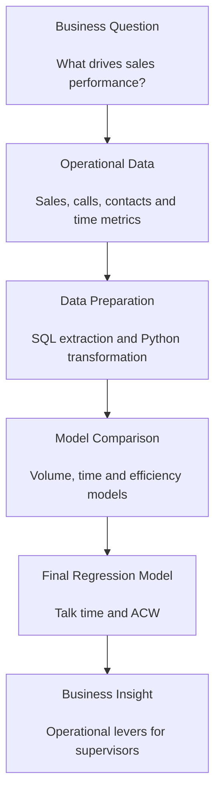
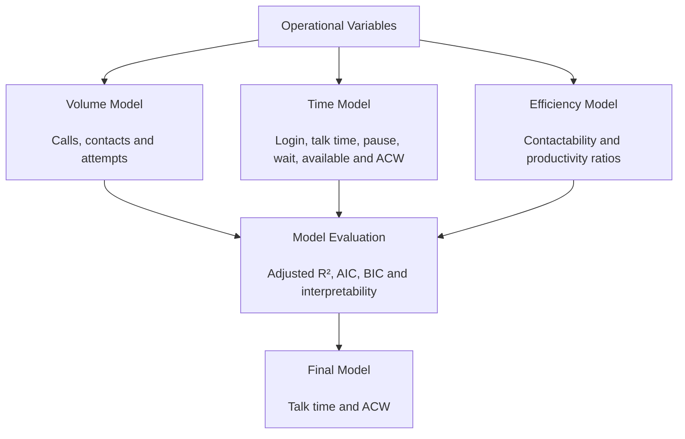
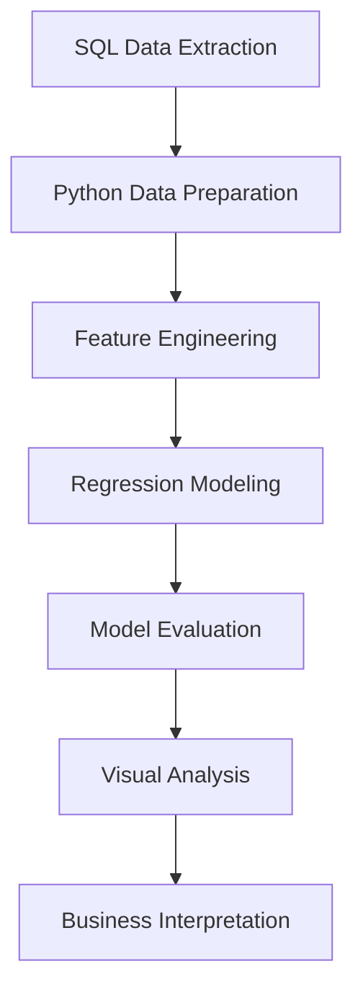

# Call Center Sales Drivers Regression Analysis

> Business-oriented regression analysis project focused on identifying operational drivers of sales performance in a call center campaign.


## Executive Summary

Call Center Sales Drivers Regression Analysis is a data analytics project designed to identify which operational variables are most associated with sales performance in a call center campaign.

The project combines SQL, Python, exploratory analysis and linear regression to evaluate how different operational factors explain daily sales results at supervisor-campaign level.

The analysis compares volume-based, time-based and efficiency-based models to determine which group of variables provides the best balance between statistical performance and business interpretability.

The final model identified talk time and after-call work as the most relevant operational drivers in the analyzed dataset.

This repository is presented as a portfolio project for Data Analyst, BI Analyst, Sales Analyst and Junior Analytics Engineer roles.

## Analysis Workflow



## Portfolio Case

| Category | Description |
|---|---|
| Industry | Call Center / Sales Operations |
| Business Area | Commercial Performance Analysis |
| Main Problem | Lack of clarity about which operational variables explain sales performance |
| Solution Type | Regression-based sales driver analysis |
| Analytical Method | Linear Regression |
| Main Tools | SQL, Python, pandas, statsmodels, Matplotlib |
| Target Roles | Data Analyst, BI Analyst, Sales Analyst, Analytics Engineer Jr |

## Business Problem

Sales operations often monitor many KPIs at the same time: call attempts, contacts, talk time, login time, pause time, waiting time, after-call work and productivity ratios.

However, not all indicators explain sales performance with the same strength.

Without a structured analytical model, supervisors may focus on metrics that are visible but not necessarily the most relevant for commercial results.

This project addresses that problem by answering a central business question:

```text
Which operational variables best explain sales performance?
```

The analysis was designed to support operational decision-making by identifying which behaviors and metrics should receive more attention during campaign management.

## Business Questions

The project focuses on answering:

- What operational factors are most associated with sales?
- Does sales performance depend more on call volume, time usage or operational efficiency?
- Which variables should supervisors monitor to improve commercial performance?
- What operational behavior should advisors prioritize to increase expected sales?
- Which indicators represent productivity and which indicators represent operational friction?

## Data Scope

The analysis was performed at supervisor-day-campaign level.

The original operational dataset included variables related to:

- Sales quantity.
- Call attempts.
- Effective contacts.
- Non-contact records.
- Login time.
- Talk time.
- Pause time.
- Waiting time.
- Available time.
- After-call work time.
- Supervisor information.
- Campaign information.

The original raw data is not included in this repository due to confidentiality restrictions.

Any data used for portfolio purposes must be anonymized or synthetic.

## Methodology

Three groups of regression models were compared:

| Model | Description |
|---|---|
| Volume Model | Evaluates call attempts, contacts and operational volume variables. |
| Time Model | Evaluates login time, talk time, pause time, waiting time, available time and after-call work. |
| Efficiency Model | Evaluates productivity ratios such as contactability, calls per hour and contacts per hour. |

The models were evaluated using:

- Adjusted R-squared.
- AIC.
- BIC.
- Coefficient significance.
- Business interpretability.

The objective was not only to find the model with the best statistical fit, but also to identify a model that could be understood and used by business stakeholders.

## Model Selection Logic



## Main Finding

The time-based model showed the strongest explanatory power among the evaluated model groups.

The final simplified model retained two key variables:

| Variable | Interpretation |
|---|---|
| `T_HABLADO_HORAS` | Talk time hours. Represents effective commercial conversation time. |
| `T_ACW_HORAS` | After-call work hours. Represents post-call operational time and potential productivity friction. |

Final model:

```text
Q_VENTAS = -0.329279 + 4.749583*T_HABLADO_HORAS - 4.062390*T_ACW_HORAS
```

Business interpretation:

- Higher talk time is positively associated with sales.
- Higher after-call work is negatively associated with sales.
- Commercial conversation time appears to be a stronger sales driver than general activity volume.
- Excessive ACW may reduce available commercial capacity.

## Business Value

This analysis provides value by:

- Identifying which operational variables are most related to sales performance.
- Helping supervisors prioritize the right KPIs.
- Distinguishing productive time from operational friction.
- Supporting coaching conversations with analytical evidence.
- Reducing reliance on assumptions when evaluating campaign performance.
- Providing a repeatable methodology for sales driver analysis.
- Translating operational data into business recommendations.

## Visual Results

### Model Comparison

The time-based model showed the strongest explanatory power among the evaluated model groups.


### Standardized Variable Impact

Talk time showed the strongest positive association with sales, while ACW represented the main operational friction.


### Sales vs Talk Time

The relationship between talk time and sales shows a clear positive pattern.

This supports the finding that effective commercial conversation time is the main operational driver.


### Sales vs ACW

ACW represents post-call work.

When ACW increases excessively, it may reduce available commercial capacity.


### Actual vs Predicted Sales

The final model shows alignment between actual and predicted sales at supervisor-day-campaign level.


### Residual Distribution

The residual histogram provides a basic view of how prediction errors are distributed around the model.


## Technical Approach

The project follows a standard analytical workflow:

1. Extract operational data using SQL.
2. Prepare and clean the dataset with Python.
3. Aggregate information at supervisor-day-campaign level.
4. Build candidate regression models.
5. Compare model performance.
6. Evaluate coefficient direction and significance.
7. Select the most interpretable model.
8. Generate visual outputs.
9. Translate statistical results into business insights.

## Technical Architecture



## Tech Stack

| Technology | Purpose |
|---|---|
| SQL | Data extraction and aggregation |
| Python | Main analysis environment |
| pandas | Data cleaning and transformation |
| statsmodels | Linear regression modeling |
| Matplotlib | Data visualization |
| Jupyter Notebook | Exploratory analysis and documentation |
| Excel | Optional validation and review |

## Repository Structure

```text
call-center-sales-drivers-regression-analysis/
│
├── README.md
│
├── data/
│   ├── raw/
│   ├── processed/
│   └── README.md
│
├── notebooks/
│   └── sales_drivers_regression_analysis.ipynb
│
├── sql/
│   └── extraction_query.sql
│
├── images/
│   ├── 01_model_comparison.png
│   ├── 02_standardized_variable_impact.png
│   ├── 03_sales_vs_talk_time.png
│   ├── 04_sales_vs_acw.png
│   ├── 05_actual_vs_predicted_sales.png
│   └── 06_residual_histogram.png
│
├── src/
│   └── analysis.py
│
├── requirements.txt
└── .gitignore
```

Adjust the structure if the actual repository uses different file names.

## How to Run

Create and activate a virtual environment:

```bash
python -m venv .venv
```

Windows:

```powershell
.venv\Scripts\activate
```

Linux or macOS:

```bash
source .venv/bin/activate
```

Install dependencies:

```bash
pip install -r requirements.txt
```

Run the analysis notebook:

```bash
jupyter notebook
```

Then open:

```text
notebooks/sales_drivers_regression_analysis.ipynb
```

## Security and Data Privacy

This repository does not include:

- Real customer data.
- Real advisor identifiers.
- Internal campaign names.
- Internal server names.
- Private credentials.
- Confidential operational files.
- Production database connections.

The project is presented as a portfolio-safe analytical case.

## Limitations

This analysis identifies statistical associations, not causal relationships.

The regression model should be interpreted as a diagnostic tool for understanding operational patterns, not as a final causal model.

Additional variables such as lead quality, product type, advisor tenure, script changes, campaign rules and external business conditions may also influence sales performance.

## Possible Extensions

Future improvements may include:

- Adding lead quality variables.
- Comparing results by campaign.
- Adding advisor tenure or experience level.
- Testing non-linear models.
- Building a forecasting model using the selected drivers.
- Creating a Power BI dashboard with regression insights.
- Automating model refresh with scheduled data extraction.
- Deploying a reusable sales performance diagnostic pipeline.

## Disclaimer

This project is a sanitized portfolio version based on a real-world sales operations analysis.

The results, coefficients and visual outputs are presented for educational and portfolio purposes.

The project demonstrates SQL, Python, regression analysis, data visualization and business-oriented analytical thinking.

## Author

**Darwin Camacho**  
Data Analyst | SQL Server | Python | Power BI | Business Intelligence | Sales Analytics

- GitHub: [darwincamacho](https://github.com/darwincamacho)
- LinkedIn: [Darwin Camacho](ADD_LINKEDIN_URL_HERE)
